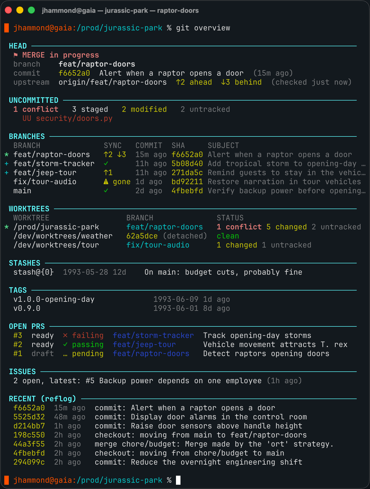

# git-tools

Some Git utilities. Installs with `install-git-tools` from my
[`.zshrc`](https://github.com/jeremy-dolan/dotfiles). See also
[terminal-tools](https://github.com/jeremy-dolan/terminal-tools).

 * `git-overview`: a one-screen bird's-eye view of local git state; strictly read-only
 * `git-reword`: reword a commit message directly without touching the work tree

If placed in $PATH, these can run as git subcommands: `git overview`, `git reword`:

